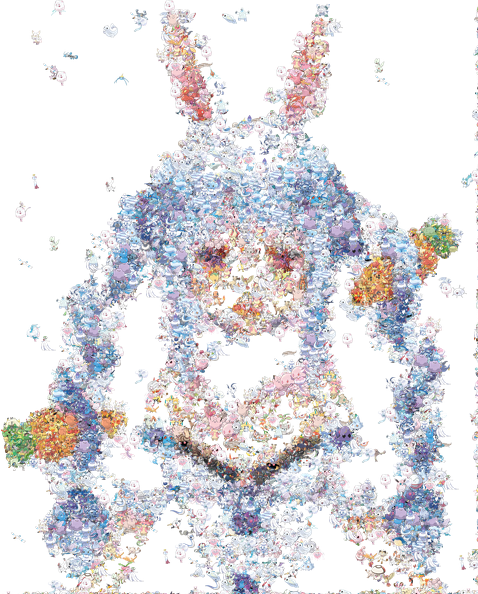

# pokemon-image-generator

Use a genetic algorithm to create an image using pokemon emojies.

Dataset: [Pokemon Images Dataset](https://www.kaggle.com/kvpratama/pokemon-images-dataset) total: 819

| Target image | Result image | Progress Image |
| ----- | ----- |  ----- |
||||

# Setup
* `conda env create`

# Usage
* Download dataset
* `python generate_image.py `

